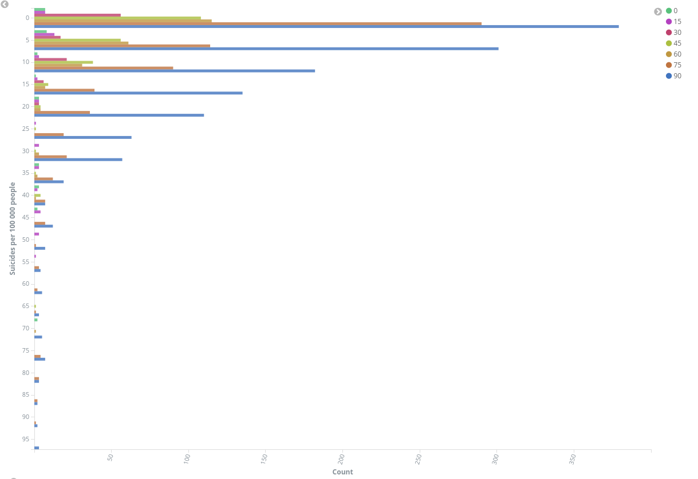

# Vizualizace dat - prezentace výsledků

## Vizualizace 1

Tento koláčový graf zobrazuje rozložení sebevražd na 100 000 obyvatel. V tomto grafu se objevují všechny věkové skupiny i obě pohlaví, stejně tak souhrny pro dané země. Jak je z grafu vidět, většina zemí a skupin v nich žijících obyvatel (děleno pouze podle věku a pohlaví) má počet sebevražd na 100 000 lidí menší než 3. V téměř 40 % skupin je méně než 1 sebevražda na 100 000 obyvatel na rok.

## Vizualizace 2

Druhá vizualizace zobrazuje počty sebevražd na 100 000 obyvatel, přičemž jednotlivé sloupce jsou ještě rozděleny podle celkového štěstí v dané zemi. Jak je vidět, čím šťastnější je obyvatelstvo, tím menší je počet sebevražd.

## Vizualizace 3

Třetí vizualizace zobrazuje počet záznamů s danými úrovněmi štěstí. Z grafu je vidět, že nejvíce států je hodnoceno 5 na škále štěstí od 0 do 7. Štěstí na nižší úrovni než 3 nemá téměř žádný stát.

## Vizualizace 4

Čtvrtý graf zobrazuje počty sebevražd na 100 000 obyvatel, přičemž každý sloupec hodnot je rozdělen podle celkové svobody v zemích. Jak je vidět, čím vyšší je svoboda, tím více je sebevražd, což je celkem překvapení.

## Vizualizace 5

Další vizualizací je heatmapa. Tato heatmapa zobrazuje korelaci mezi důvěrou ve vládu a vnímání její korupce. Z heatmapy to vypadá, že by zde korelace být mohla, jelikož u záznamů, kde je vysoká vnímaná korupce, je i nízká důvěra.

## Vizualizace 6

Na této vizualizace je vidět počet zemí s určitými úrovněmi politických práv. V této vizualizace jsme se omezili pouze na záznamy celých zemí. Vidíme, že většina zemí má u politických práv hodnotu 1, což znamená, že mají dobrá politická práva a jsou to pravděpodobně velmi svobodné země.

## Vizualizace 7

Další vizualizací je tabulka dat o populacích. Opět jsem se omezil na celé země a vypadá to, že drtivá většina zemí má mezi 1 a 100 miliony obyvatel.

## Vizualizace 8

Poslední vizualizací je metrika počtu sebevražd. Zobrazuje 20 zemí s největším počtem sebevražd za rok seřazených sestupně.

